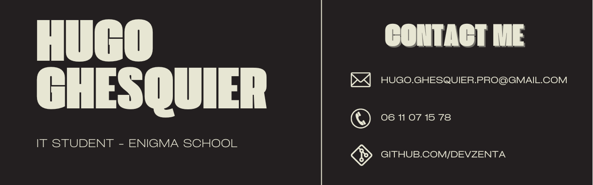

# 💫About Me :

👋 Hi, my name's Hugo Ghesquier, I'm 18 and I've been passionate about computers since I was very young. 
🎓 I am currently studying computer science at ENIGMA-School based in Lille. 
🔍 I'm looking for an internship in backend development or cyber security. 

# 

# 🌐Socials
 

# 💻Tech Stack
              
# 📊GitHub Stats :
 
 

# 🏆GitHub Trophies

